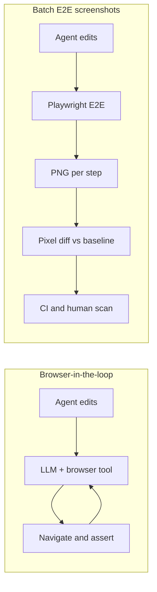
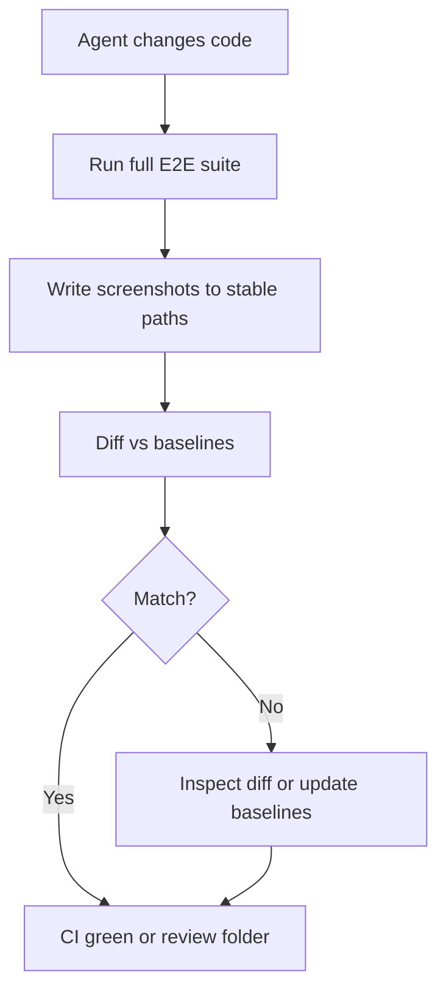

On frontend work with **AI coding agents**, the limiting factor is rarely “can the model produce a plausible diff?” It is whether I can **verify** outcomes fast enough to stay ahead of the edit stream. Browser MCPs and hosted browser APIs were my first answer. They worked until I tried to scale with an agent that makes dozens of edits per session.

The problem is not capability. It is **throughput**. Every navigation, hover, and full pass through the app costs time and tokens. Thirty edits with a full browse after each one stopped scaling for me: verification became the bottleneck, not the code.

So I dropped **browser-in-the-loop** checks for day-to-day verification and went back to something simpler: **screenshots from E2E tests**, compared in CI—**visual regression testing** without the model re-driving Chrome after every change. Verification becomes a batch job, not a browsing session. I have been running this loop against a lab app I keep in `~/ai-teams`; nothing special about the path—the pattern is portable.

## Browser-in-the-loop vs batch E2E screenshots

The first path still wins for **exploration**, one-off repro, and “what does this screen do?” The second is what I use for **repeatable frontend verification** when the agent is iterating in a tight loop.

## The loop

This is the **E2E screenshot verification loop** I run on a **fixed runner** (same viewport, seeded data, stable paths):

1. **The agent changes code**—UI, logic, whatever the task needs.
2. **The full E2E suite runs**—Playwright, isolated DB, fixed ports.
3. **Each test writes a screenshot** to a stable path like `screenshots/agents/01-list.png`.
4. **New images are diffed against baselines**—pixelmatch with `threshold: 0` in my setup, so the bar is strict: intentional UI change means updating baselines. That strictness trades away “ignore harmless drift”—font smoothing, anti-aliasing, or GPU quirks can force a PNG refresh even when the UI is fine. I accept that trade on purpose.
5. **I scan the output folder or the diff** and see what moved in seconds.

Same seed data, same ports, same ordering every run. That is as **reproducible** as E2E gets: fixed viewport, one runner image, no live network surprises *if* the tests control the network the way you think they do. Flakes can still happen—fonts, GPU, a race you have not killed—but you are not adding LLM-in-the-loop variance on top.

**Why I bother:** no per-step model calls to drive a browser (I still pay **CI** minutes, runner time, and artifact storage—trading token burn for pipeline cost). The suite finishes in minutes while a manual pass through every screen does not scale with how often the agent commits. The result is **binary on pixels**: either the frame matches the baseline or it does not—no “looks fine” from a model that defaults to yes. And it is **scannable**: I triage **visual** impact from the images before I read every line diff. The folder is plain files—diffable, committable, no proprietary viewer.

## The honest limitation

This catches **rendering** regressions: what landed on screen. It does not catch **logic bugs** that still paint the right picture. Wrong number, right font—screenshots will not save you. You still want unit tests, **typecheck**, **lint**, and whatever else you trust. Extras that barely move pixels—some **accessibility** issues, some empty states—stay outside this layer too.

## The story that still bothers me

A slice was marked done: `pnpm check` green, screenshots produced, README gallery updated. Then someone actually looked at the PNGs. Large blank white patches sat where content should have been. Root cause: a missing `bg-page` on a root layout wrapper.

The agent did not flag it. The gates I had automated did not flag it. The **saved screenshot** showed it—once a human treated the image as an artifact worth reading, not only a pass/fail bit.

What followed was worse: a narrow workaround shipped instead of fixing the layout. It cleared the same gates. Without a human looking at the images, it would have gone out.

That is why manual screenshot review stays a merge gate for me. Automation tells me whether pixels match baselines; it does not tell me whether the picture is *right*. Pixel diff is one layer. Human glance catches semantic garbage the stack cannot encode.

## If you try this Monday

It is not “AI tooling.” It is **E2E** with a human-readable artifact. The recurring cost is **baseline hygiene**: real UI work means reviewing diffs, approving new PNGs, and committing them—same discipline as any **snapshot** workflow.

What made it stick:

- **Exact match (`threshold: 0`).** Slop in the threshold becomes slop in the process.
- **Sequential runs.** I trade wall-clock for ordering I can reason about; timing bugs love parallel suites. If you shard, you are making a tradeoff, not discovering a free lunch.
- **Isolated DB per run** so state does not leak between tests.
- **Named, numbered paths** so `agents/01-list.png` tells you the story without opening the file.

## The point

Browser tools optimize for *navigating* like a user. Agents doing bulk edits need to **verify outcomes**—same as any fast feedback loop. Pixels are the receipt, not the verdict.

I spent a long time on the browser-in-the-loop path before this clicked. The shift was not falling out of love with browsers; it was admitting that **throughput** for verification had to match **throughput** for edits.

---

I am curious what **verification loops** others have settled on for **coding agents**—especially ones that keep up when the agent is editing all day. If you have a pattern that survived real use, I would like to hear it.
