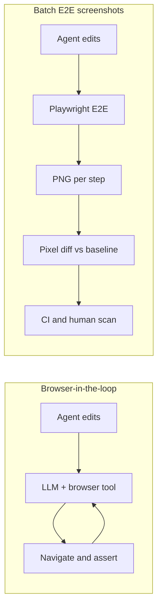
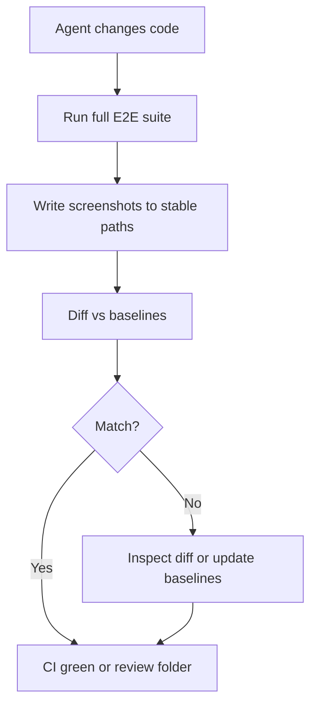

> **TL;DR:** When an agent makes dozens of frontend edits per session, verification becomes the bottleneck, not code generation. I stopped having the model drive a browser after each edit. Instead, the full Playwright suite writes a screenshot per step, CI diffs them against committed baselines with zero tolerance, and a human scans the images before merge. Pixel diffs catch rendering regressions. Only a person catches a picture that matches the baseline but is wrong.
{: .prompt-tip }

Browser MCPs and hosted browser APIs were my first answer to "did the agent's change work?" They held up until I worked with an agent that makes dozens of edits per session.

The problem is not capability. It is **throughput**. Every navigation, hover, and pass through the app costs time and tokens. Thirty edits with a full browse after each one did not scale: verification fell behind the edit stream.

So for day-to-day checks I went back to something simpler: **screenshots from E2E tests, compared in CI**. Visual regression testing, without the model re-driving Chrome after every change. Verification becomes a batch job, not a browsing session. I run this against a lab app, but nothing about the pattern is specific to it.

## Browser-in-the-loop vs batch E2E screenshots


```mermaid
flowchart LR
  subgraph slow["Browser-in-the-loop"]
    A1[Agent edits] --> B1[LLM + browser tool]
    B1 --> C1[Navigate and assert]
    C1 --> B1
  end
  subgraph fast["Batch E2E screenshots"]
    A2[Agent edits] --> D2[Playwright E2E]
    D2 --> E2[PNG per step]
    E2 --> F2[Pixel diff vs baseline]
    F2 --> G2[CI and human scan]
  end
```

The browser path still wins for **exploration**, one-off reproduction, and "what does this screen do?" The batch path is what I use for **repeatable verification** while the agent iterates in a tight loop.

## The loop

It runs on a **fixed runner**: same viewport, seeded data, stable paths.


```mermaid
flowchart TD
  S1[Agent changes code] --> S2[Run full E2E suite]
  S2 --> S3[Write screenshots to stable paths]
  S3 --> S4[Diff vs baselines]
  S4 --> S5{Match?}
  S5 -->|Yes| S6[CI green or review folder]
  S5 -->|No| S7[Inspect diff or update baselines]
  S7 --> S6
```

1. The agent changes code. UI, logic, whatever the task needs.
2. The full E2E suite runs. Playwright, isolated database, fixed ports.
3. Each test writes a screenshot to a stable path such as `screenshots/agents/01-list.png`.
4. New images are diffed against baselines with pixelmatch at `threshold: 0`. Any intentional UI change means updating baselines. The cost of that strictness: font smoothing, anti-aliasing, or GPU differences can force a refresh when the UI is fine. I accept that trade on purpose.
5. I scan the folder or the diff and see what moved in seconds.

Same seed data, same ports, same ordering every run. That is about as reproducible as E2E gets, provided the tests really control the network. Flakes still happen (fonts, GPU, an unfixed race), but there is no model-in-the-loop variance on top.

What this buys:

- **No per-step model calls** to drive a browser. I pay in CI minutes, runner time, and artifact storage instead of tokens.
- **Minutes, not sessions.** The suite finishes in minutes. A manual pass through every screen does not scale with how often the agent commits.
- **A binary answer.** The frame matches the baseline or it does not. No "looks fine" from a model that defaults to yes.
- **Scannable artifacts.** I triage visual impact from images before reading every line of the diff. The output is plain files: diffable, committable, no special viewer.

## A minimal Playwright version

You do not need a separate screenshot tool. Playwright has a built-in [screenshot assertion](https://playwright.dev/docs/test-snapshots):

```typescript
import { test, expect } from '@playwright/test';

test('home page', async ({ page }) => {
  await page.goto('/');
  await expect(page.getByRole('main')).toBeVisible();
  await expect(page).toHaveScreenshot('home.png', {
    fullPage: true,
    threshold: 0,
    maxDiffPixels: 0,
  });
});
```

This assumes `baseURL` points at your running app. Replace the generic `main` check with an assertion that the content you care about has loaded. Use the same seeded data, browser, viewport, and runner for the baseline and every later comparison.

Generate the first baseline with `pnpm exec playwright test --update-snapshots`, inspect it, and commit it. After that, run `pnpm exec playwright test` without the flag, and only update a baseline after reviewing an intentional change. Auto-approving new images defeats the point.

`threshold: 0` sets the allowed per-pixel color difference. `maxDiffPixels: 0` allows no differing pixels. That is not byte-for-byte PNG equality, which is another reason to keep the rendering environment fixed.

## What it does not catch

This layer catches **rendering** regressions: what landed on screen. It does not catch logic bugs that paint the right picture. Wrong number, right font: the screenshot passes. You still need unit tests, typecheck, and lint. Problems that barely move pixels, such as many accessibility issues or untested empty states, are outside this layer too.

## The failure that still bothers me

A slice was marked done: `pnpm check` green, screenshots produced, README gallery updated. Then someone looked at the PNGs. Large blank white patches sat where content should have been. Root cause: a missing `bg-page` class on a root layout wrapper.

The agent did not flag it. The automated gates did not flag it. The **saved screenshot** showed it, once a human treated the image as an artifact worth reading rather than a pass/fail bit.

Then it got worse: a narrow workaround shipped instead of a layout fix, and it cleared the same gates. Without a human looking at the images, it would have gone out.

That is why manual screenshot review stays a merge gate for me. Automation says whether pixels match the baseline. It cannot say whether the baseline is right.

## If you try this

It is not AI tooling. It is E2E with a human-readable artifact. The recurring cost is **baseline hygiene**: real UI work means reviewing diffs, approving new PNGs, and committing them, the same discipline as any snapshot workflow.

What made it stick:

- **Exact match (`threshold: 0`).** Slack in the threshold becomes slack in the process.
- **Sequential runs.** I trade wall-clock time for an ordering I can reason about. Timing bugs love parallel suites. Sharding is a tradeoff, not a free speedup.
- **An isolated database per run**, so state does not leak between tests.
- **Named, numbered paths**, so `agents/01-list.png` tells you what it is without opening it.

## The point

Browser tools are built to *navigate* like a user. An agent doing bulk edits needs its outcomes *verified*, like any fast feedback loop. Pixels are the receipt, not the verdict.

The shift for me was not giving up on browsers. It was admitting that verification throughput has to match edit throughput.

---

For the orchestration side, see [how the OpenCode plugin separates planning from edits]().

If you have a verification loop for coding agents that survived real daily use, I would like to hear about it.
